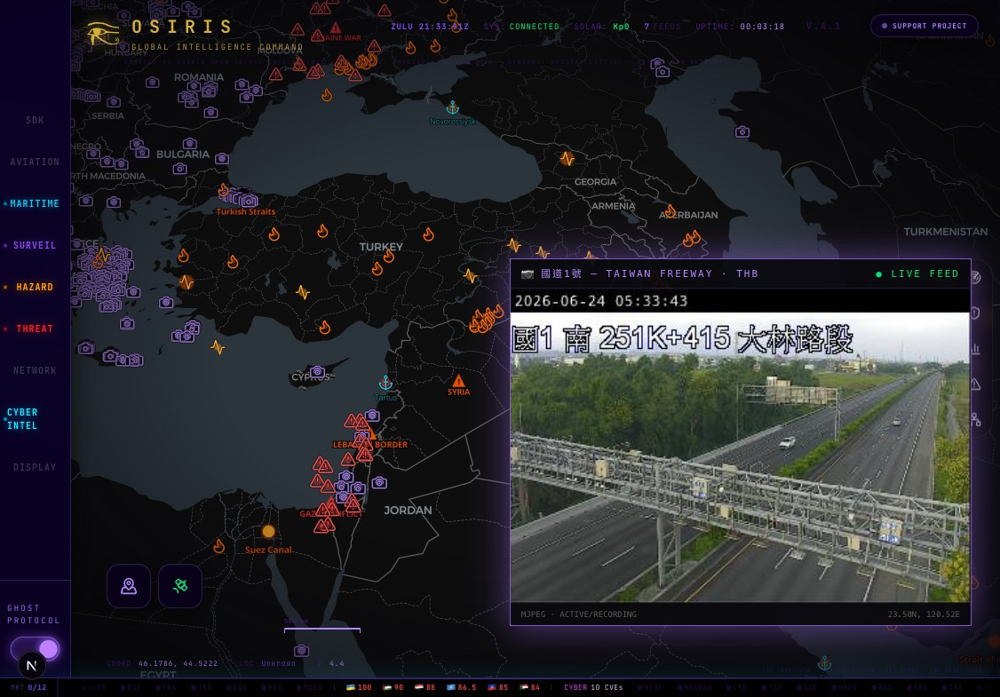
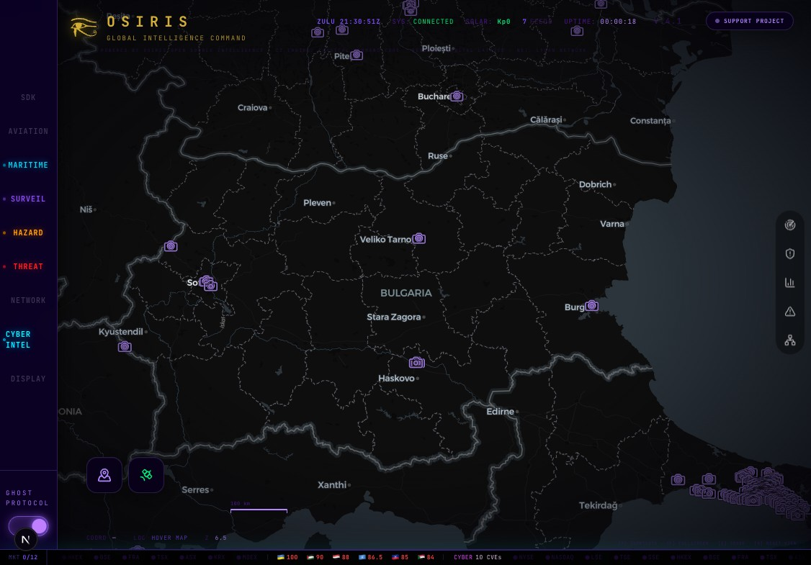
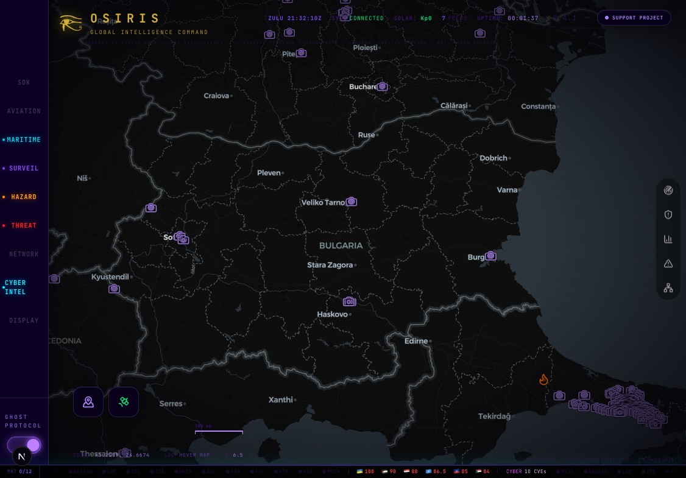

<div align="center">

# ⬡ OSIRIS

### Open Source Intelligence & Reconnaissance Integrated System

**A real-time global intelligence dashboard** that aggregates live flight tracking, government highway CCTV networks, earthquake & wildfire monitoring, conflict-zone mapping, cyber-threat intel and 24/7 news into a single GPU-accelerated map.

Built with **Next.js 16 · React 19 · MapLibre GL (WebGL)**.

</div>

---

## 📸 Screenshots

| Live CCTV feed over the multi-layer map | CCTV camera markers | Threat / intel layers |
|---|---|---|
|  |  |  |

*Every resource type has its own map icon (camera = CCTV, flame = fire, triangle = incident, ⚓ = port, etc.); resources without a distinct icon fall back to a colour-coded dot.*

---

## 🗺️ Map options (layers) & data sources

Layers are grouped in the left rail. Each toggles a live data source on the map.

| Group | Layer | Source | Notes / limitations |
|-------|-------|--------|---------------------|
| **AVIATION** | Commercial / Private / Jets / Military flights | OpenSky Network | Keyless feed works; an OpenSky app key raises rate limits. |
| **MARITIME** | Ports / Ships / Chokepoints | Static naval intel + AIS (`aisstream.io`) | Live ship positions need a free `AIS_API_KEY`; ports/chokepoints are static. |
| | Submarine Cables | TeleGeography-derived static GeoJSON | Static reference data. |
| | Satellites | CelesTrak TLE (+ optional N2YO) | Keyless TLE; `N2YO_API_KEY` only for extra detail. |
| **SURVEIL** | **CCTV Cameras** | Government traffic authorities + `open-webcams` (~6,000 global) | See **CCTV coverage** below — *not all feeds work everywhere*. |
| | Live News Feeds | Curated 24/7 YouTube/stream embeds | Some streams go offline over time. |
| **HAZARD** | Earthquakes (24h) | **USGS + EMSC**, merged & deduped | Keyless. EMSC adds strong EU/Asia coverage USGS misses. |
| | Active Fires | **NASA FIRMS** — VIIRS S-NPP / NOAA-20 / NOAA-21 + MODIS, + EONET volcanoes | Keyless. Capped to ~3,000 hotspots for performance. |
| | Severe Weather | **NASA EONET + NOAA/NWS + GDACS** | Keyless. NWS alerts are US-only; GDACS adds global cyclones/floods/droughts. |
| **THREAT** | Nuclear Facilities / Power Plants | Static + open datasets | Reference data. |
| | Global Incidents | **GDELT 2.0 GEO** + **ACLED** (opt-in) + simulated fallback | GDELT's GEO endpoint is intermittently down upstream; ACLED needs an account with API access (see below); liveuamap has **no API** (popups link out to it). A simulated set shows only if all live sources fail. |
| | GPS Jamming | Aggregated reports | Sparse / best-effort. |
| | Ransomware Victims | `ransomware.live` | Public feed. |
| **NETWORK** | Live Malware / Blocklisted IPs / Phishing / SSL Blacklist | abuse.ch, Blocklist.de, PhishTank, AbuseIPDB | AbuseIPDB enrichment uses `.abuseipdb_key` if present. |
| **CYBER INTEL** | Active CVE Threats | NVD | Keyless. |
| | Routing Intel (DROP) | Spamhaus DROP | Keyless. |
| | Tor Exit Nodes | Tor Project | Keyless. |
| | MITRE ATT&CK | MITRE ATT&CK STIX | Keyless. |
| **DISPLAY** | Day/Night · 3D Terrain | Computed / MapLibre terrain | Visual only. |
| **RECON** (toolkit) | Port scan · SSL · headers · DNS · WHOIS · vuln | Companion **`osiris-scanner`** sidecar | Optional separate service; needs `SCANNER_KEY` (see below). |

### 🎥 CCTV coverage — and its limits

CCTV is sourced from **official government transport-authority feeds** plus a global open-webcam dataset. Highlights and **known limitations**:

- **Taiwan** (THB freeway + provincial, ~3,700 cams) — works globally. ✅
- **Indonesia** (Jasa Marga / Bina Marga) — many feeds are **geo-restricted to Indonesian IPs** and return empty/black off-shore; CORS-inconsistent HLS feeds are routed through a same-origin proxy. ⚠️
- **EU / US / HK / AU / NZ / Japan** and others — included; coverage and uptime vary by authority.
- **`open-webcams`** — ~6,000 public webcams across 80+ countries (keyless), so most regions show *something* even without a national feed.

**General CCTV caveats:** individual cameras go offline; some authorities serve `http`-only or slow MJPEG (handled by the proxy with `http→https` upgrade and a load-driven frame refresh); geo-restricted national feeds cannot be made to work from outside that country.

> ℹ️ Adding more national highway-CCTV networks (Japan, South Korea, more EU/APAC) is tracked in `.omo/plans/cctv-gov-highways.md`.

---

## ⚠️ "Not all data is workable"

This is a research/educational aggregator of third-party open sources. Expect:

- **Upstream outages** — e.g. GDELT's GEO API returns 404s for everyone at times.
- **Geo-restrictions** — some CCTV/government feeds only respond to in-country IPs.
- **Gated data** — ACLED requires an account *with API access granted*; some feeds need a free key.
- **Stale / offline endpoints** — individual cameras, news streams and reports come and go.

Routes are written defensively: each source has its own timeout and a failing source never breaks the rest of the map.

---

## 💻 Requirements

**Software**
- **Node.js ≥ 20** (developed on Node 26) and **npm**.
- A modern **WebGL2** browser (Chrome/Edge/Firefox/Safari).
- OS: macOS / Linux / Windows.
- *(Optional, for RECON)* the `osiris-scanner` Node sidecar.

**Hardware**
- GPU-accelerated browser strongly recommended (the map renders thousands of WebGL points).
- ~2 GB free RAM for the dev server; ~1.5 GB disk for `node_modules`/build.

**Resources / accounts** — *the app runs fully without any keys.* Keys/credentials only unlock extra sources (see Configuration).

---

## 🚀 Download & run

```bash
# 1. Clone
git clone https://github.com/<your-username>/osiris.git
cd osiris

# 2. Install dependencies
npm install

# 3. Configure (all keys are OPTIONAL — copy the template and fill what you want)
cp .env.example .env.local
#   edit .env.local and add any keys/credentials you have

# 4. Run the dashboard
npm run dev
#   → open http://localhost:3000
```

**Run with the RECON scanner too** (optional): place the `osiris-scanner` sidecar as a sibling folder and use the bundled launcher, which starts both:

```bash
npm run osiris      # starts the scanner (:7700) + dashboard (:3000)
```

Build for production:

```bash
npm run build && npm start
```

---

## 🔑 Configuration (`.env.local`)

Copy `.env.example` → `.env.local`. **Nothing is required** — every variable is optional and the matching feature simply stays off (keyless) when unset.

| Variable | Unlocks | Where to get it |
|----------|---------|-----------------|
| `SCANNER_URL`, `SCANNER_KEY` | RECON toolkit (port scan, SSL, DNS, WHOIS, vuln) | Generate a key and set the same value as the `osiris-scanner` sidecar's `OSIRIS_KEY`. |
| `ACLED_EMAIL`, `ACLED_PASSWORD` | ACLED structured conflict events in Global Incidents | Free account at <https://acleddata.com/register/>. **Requires API access on your account** — request it from ACLED (corporate/commercial use may need a licence). SSO/Google accounts must set a password. |
| `FIRMS_API_KEY` | Per-area FIRMS API (the global fire CSV is already keyless) | <https://firms.modaps.eosdis.nasa.gov/api/map_key/> |
| `OPENSKY_CLIENT_ID/SECRET` | Higher aviation rate limits | <https://opensky-network.org/> |
| `AIS_API_KEY` | Live ship positions (AIS) | <https://aisstream.io/> |
| `ISMALICIOUS_KEY` | IP/domain reputation enrichment | <https://ismalicious.com/> |

After editing `.env.local`, **restart the dev server** (Next.js reads env at startup).

> 🔒 `.env.local` and key files (`.abuseipdb_key`, etc.) are git-ignored — never commit credentials.

---

## 🧩 Architecture (brief)

- **Frontend:** Next.js 16 App Router, React 19, MapLibre GL. The map and layer logic live in `src/components/OsirisMap.tsx`; layer registry in `src/components/LayerPanel.tsx`; per-layer marker icons in `src/components/mapMarkers.ts`; the CCTV viewer in `src/components/CameraViewer.tsx`.
- **Backend:** Next.js API routes under `src/app/api/*` — one route per data domain (`cctv`, `earthquakes`, `fires`, `weather`, `gdelt`, …). CCTV per-country sources live in `src/app/api/cctv/<country>.ts` and are aggregated by `src/app/api/cctv/route.ts`. Cross-origin camera streams are proxied by `src/app/api/cctv/proxy` (MJPEG) and `src/app/api/cctv/hls` (HLS).
- **RECON:** the optional `osiris-scanner` sidecar exposes the scan endpoints the dashboard proxies via `/api/scanner`.

---

## 📜 License & attribution

Released under the **MIT License** — see [`LICENSE`](LICENSE).

OSIRIS is built on the open-source [OSIRIS project by simplifaisoul](https://github.com/simplifaisoul/osiris). All third-party data belongs to its respective providers (NASA, USGS, EMSC, GDELT, ACLED, government transport authorities, abuse.ch, MITRE, etc.) and is subject to their terms — this project is for research and educational use.
